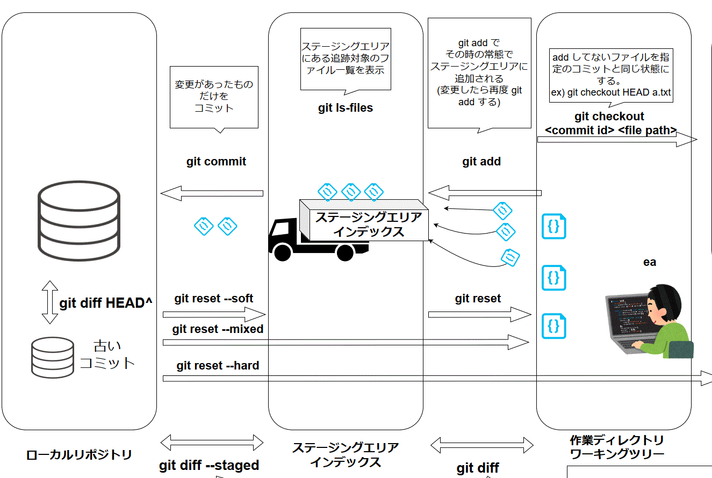
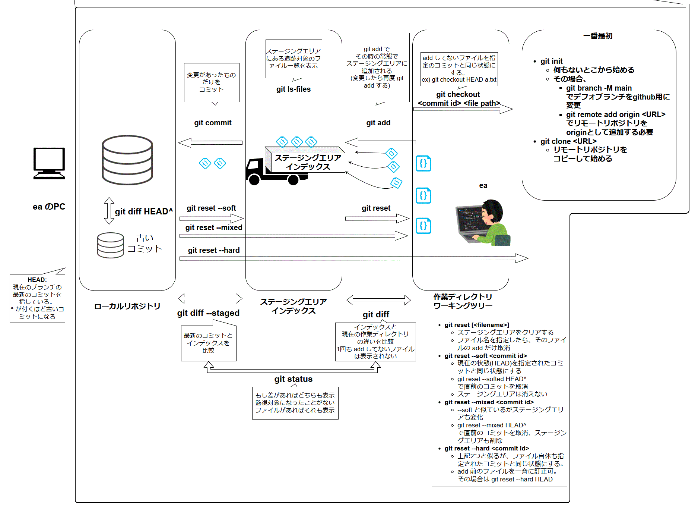
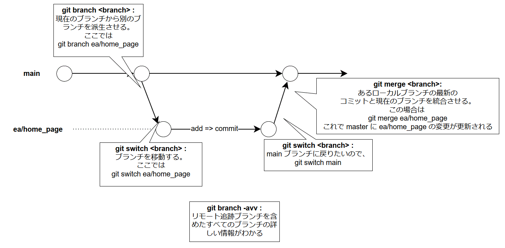
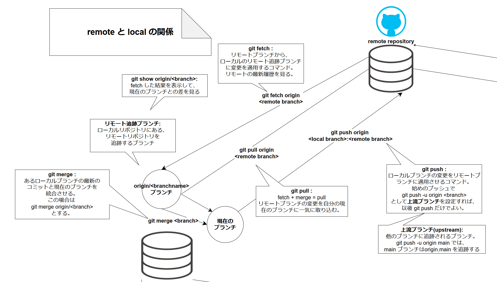
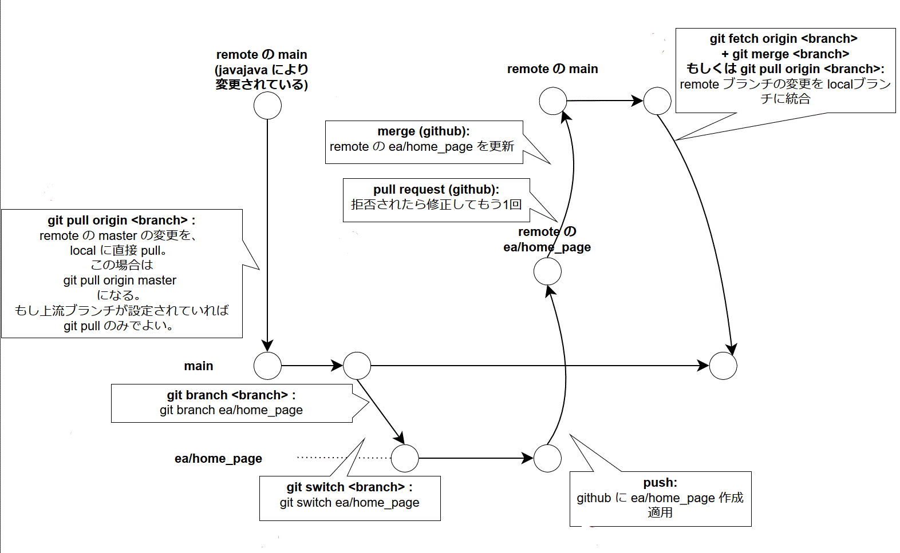

## 0. はじめに


Git がインストールされていること、 GitHub のアカウントがあることが前提。    
Git, GitHub の基礎知識があればなおよい。

### 0.1 説明しないこと

* git インストール, github アカウント作成 
* 共同開発の「お作法」
* GitHub 以外のサービスを使う場合
* Git内部の仕組み、コマンド等の詳細な説明

### 0.2 概要

#### 0.2.1 Git, GitHub とは

* Git =>**分散型バージョン管理システム**
    * 「分散型」: **リポジトリ** を分散して管理。複数人でも管理しやすく。  
        * 「リポジトリ」 : 保管場所とログのまとまりのようなもの   
    * 「バージョン管理システム」: ログの管理。リポジトリの差分を利用。    

* GitHub => Git を Webサービスにして、さらに機能を追加したもの。リモートリポジトリを提供する。

#### 0.2.2 リポジトリ

「リポジトリ」: 保管場所とログのまとまり

リポジトリは2種類
* **リモートリポジトリ**:  
専用のサーバなどにある。複数人のコードがここに統合・共有される。

* **ローカルリポジトリ**:  
個人のマシンなどの中にある。使用者はそのユーザのみの想定。


開発者はローカルリポジトリで開発を行い、その変更をリモートリポジトリにアップロードする(push)。   
また他の人が行ったリモートリポジトリの変更を、自分のローカルリポジトリに適用させることもある(pull)。


#### 0.2.3 ローカルリポジトリにおけるバージョン管理

基本的には以下のような流れで、変更をリポジトリに更新する。




```
* 作業ディレクトリ: 私たちが普段使っている素のディレクトリ。(ワークツリーとも)
|
|- Add コマンド: ファイルをインデックスに登録し、次のコミットのターゲットとする。`add` されたファイルは「その時の状態」で登録される。つまり変更した場合は再度 `add` する必要がある。
V
* インデックス: コミットを行う準備をするための場所。コミット予定のファイルを追跡。無駄なファイルのコミットを防ぐ。(ステージングエリアとも)
|
|- Commit コマンド: インデックスからローカルリポジトリへ差分を更新。コミット(差分)の生成。
V
* リポジトリ: ローカルリポジトリ
```
このワークフローがあることで、無駄なファイルのコミットで履歴を複雑にすることを防いでいる。


#### 0.2.4 リモートリポジトリとのやり取り

以下のようなコマンドを使い、ローカルリポジトリの変更をリモートリポジトリに適用、もしくは逆にリモートリポジトリからローカルリポジトリへ更新する。

また clone では リモートにあるリポジトリを丸ごと(branch, 変更履歴を含めて) ローカルにコピーすることができる。

コマンドと説明: 
| コマンド | 説明                                               |
| -------- | :------------------------------------------------- |
| Push     | ローカルリポジトリの変化をリモートリポジトリに反映 |
| Pull     | リモートリポジトリの変化をローカルリポジトリに反映 |
| Clone    | リポジトリを丸ごとローカル環境にコピーする         |


#### 0.2.5 ブランチの使用

ブランチというものを使用すると、本流はそのまま残した上で、それから分離した作業ディレクトリ、ステージングエリア、履歴を持つことができる。

またブランチは統合(merge)することができる。


```


branch-b           +---+----+-------
                  /          \
branch-a   +--+--+------------+------       

                 |　　　　　　　┗ branch-b の変更を branch-a に統合している
         branch-a から branch-b 
         を派生させている
```


## 1. git プロジェクトのすすめかた

### 1.1 Git プロジェクトの開始


#### 1.1.1 何もないところから、もしくはすでに自分のPCにあるプロジェクトを追加する

なにもないところから、自分のPCで git を用いて管理をする。   
もしくはすでに自分のPCにあるプロジェクトを Git で管理する。
1. ディレクトリを作成
1. `git init` で初期化
    1. するとカレントディレクトリをリポジトリになり、 `.git` フォルダが作成される
    2. はじめから何かファイルがあっても問題ない
        1. しかしその場合は、add する前に `.gitignore` を書かないと、個人情報等悲惨なことに
            1. add, commit 後でも修正できるが面倒。remote に push した場合は終わり。
        2. `.gitignore` 書いたら `git status` で適用されていることを確認
2. `git branch -M main` で デフォルトブランチを変更
    1. github の仕様変更に合わせてデフォルトブランチを `master` から `main` に変更
    2. 行わなくても問題ない
3. GitHub でからのプロジェクトを作成。  
    1. GitHub にアクセスし、 New Repository をする。
    2. プロジェクト名は URL の一部になる。
4. `git remote add origin <URL>` で リモートブランチを追加
    1. リモートブランチを `origin` として追加。
    2. `<URL>` は先ほど作った空のプロジェクトのもの。作成するとわかりやすく出てくる。    
       例えば `https://github.com/{GitHubアカウント名}/{プロジェクト名}.git` のようなもの。     


#### 1.1.2 すでに GitHub 等にあるリポジトリを clone して始める

ここでは、共同開発等で誰かがすでに作ったリポジトリを clone して始めることを想定している。    
共同編集者であることが前提。  GitHub で招待してもらう。

もし共同編集者ではない場合、一度自分のアカウントに fork して、それを clone する。ものによって、いろいろなお作法があるかもしれないので注意する。


1. `git clone <URL>` で clone する
    1. 履歴やブランチ等が丸ごとコピーされる。
    2. リポジトリの権限を持っていれば `git add remote` は必要ない 


### 1.2 ローカルでのバージョン管理



1. `git add <filename>` で ステージングエリアにファイルの中身を追加
    1. カレントディレクトリ全てのファイルの場合、 `git add .`
    2. commit する前に変更があった場合、再度 git add する必要がある。
        1. その時は `git diff` や `git status` を使って現在の作業ディレクトリと、ステージングエリアの差を比較する。
    3. `.gitignore` のファイルは add されない
    4. もしステージングエリアへの追加を取消たいなら `git reset <filename>` をする。
        1. まだコミットしていない場合のみ
2. `git commit -m "コミットメッセージ"` でステージングエリアにあるファイルの状態をリポジトリに追加する。
    1. コミットメッセージはなるべくわかりやすく書く
    2. `git diff --staged` や `git status` でステージングエリアとリポジトリを差を比較する
    3. コミットをある状態に戻すには `git reset --soft <commit id>` か `git reset --mixed <` を使う
        1. `git reset --soft <commit id>` : コミットのみを取り消し、ある時点のコミットと同じ状態にする。ステージングエリアは変更しない。`^HEAD` で直前のコミットを取り消し。
        2. `git reset --mixed <commit id>` : --soft と似ているがステージングエリアも変化。
        3. `git reset --hard <commit id>` : 上記2つと似るが、ファイル⾃体も指定されたコミットと同じ状態にする。

### 1.3 ブランチの利用

ブランチというものを使用すると、本流はそのまま残した上で、それから分離した作業ディレクトリ、ステージングエリア、履歴を持つことができる。    
またブランチは統合(merge)することができる。



1. `git branch` で今あるブランチの一覧を確認できる。
    1. **現在** 自分がいるブランチは **アスタリスクが付き、緑色でハイライト** される。
    2. `git branch -a` とすると、リモートブランチも表示される 
2. `git branch <branch name>` で現在のブランチから**別のブランチを派生**させる。このブランチは派生元のブランチの履歴等を受け継ぐことができる。
3. `git switch <branch name>` で指定したブランチへ**移動**することができる。
4. `git merge <branch name>` で現在のブランチにそのブランチの**変更を統合**できる
    1. **現在のブランチが `feature-ea-fetchjs`** で`git merge main` とした場合、メインブランチの変更を現在のブランチに適用できる。
5. `git branch -d <branch name>` でそのブランチを削除できる
    1. ただし、 `git branch --merged` で表示されるマージ済みのブランチしか削除できない


### 1.4 リモートリポジトリとのやり取り

GitHub などのサービスを使えば、リモートにもリポジトリを置くことができる。またこれを用いて共同開発をすることができる。(後述)



1. **`git push`** でローカルブランチの変更をリモートに適用できる
    1. ただしこのように使うには「**上流ブランチ**」を定める必要がある。(そのローカルが追跡するリモートブランチのこと)
    2. `git push -u origin <remote branch>` で設定できる
    3. `git push origin <local branch>:<remote branch>` で都度指定してあげることもできる
2. **`git pull`** でリモートの変更をローカルに適用できる(上流ブランチを定めていた場合)
    1. `pull = fetch + merge` である。
        1. `fetch`: 
            1. 「リモート追跡ブランチ」という「ローカルリポジトリにあるブランチで、(当該のブランチの)リモートリポジトリを追跡するもの」ものがある
            2. それに対して、リモートリポジトリの変更を追加するもの。
            3. リモート追跡ブランチは `origin/<branch name>` というように表される。
            4. `git fetch` した後に、 `git show origin/<branch name>` とすれば、リモート追跡ブランチとローカルブランチの差異を見ることができる
        2. ブランチの差異を見た後、それでよければ現在のブランチで `git merge origin/<branch name>` とする。すると現在のブランチに変更が適用される。
        3. つまり `git pull` は、「リモート追跡ブランチに変更を適用したあと」「現在のブランチにリモート追跡ブランチの変更を適用する」ということを一気にしている


### 1.5 共同開発

共同開発はざっくりと以下のような流れで行うことが多い



1. まずは自分自身ののブランチを切り、そこで作業
    1. 派生もとは github-flow なら `main`
    2. コマンドは
        1. `git branch <new branch>` でブランチ派生(自分がどこのブランチにいるか確かめてから行う)
        2. `git switch <new branch>` で移動
        3. `add`, `commit` ...etc
2. 作業したら**リモートの作業ブランチ** に push
    1. 上流ブランチを定めたうえで `git push` (自分でローカルでつくったブランチはリモートにはないので、必ず上流ブランチを定める)
    2. GitHub 上で確かめる
3. GitHub 上でプルリクエストを出して main 等に merge
    1. GitHub 上でプルリクエストを出す
    2. コンフリクトしなかったら merge
        1. しちゃったらブラウザ上で直すか、ローカルで作業して push
4. 他の人が行った変更を自分のローカルの `main` ブランチに pull 
    1. **これは結構頻繁に行うべき**。 
        1. なぜなら他の人の実装が変わることで自分のが動かなくなる
        2. コンフリクトが起きやすくなるという危険が増すから
    2. **`main` にて** `git pull`
5. ローカルの `main` を、作業しているブランチに merge 
    1. 作業ブランチに移動し
    2. `git merge main` 
    3. もしコンフリクトが起きたら
        1. `git checkout --theirs <filename>` : `main` ブランチを優先
        2. `git checkout --ours <filename>` : 作業しているブランチを優先 ...等する
6. 繰り返し


## 2. その他知識

### 2.1 .gitignore

Git の管理下に置きたくないファイル等を記述する。例えば以下のようなものは置きたくない

* 個人情報等公開できない情報
* ライブラリ、パッケージのディレクトリ等
* 一時ファイル等

`.gitignore` には1行で1つのものを記述する

例)
```.gitignore
# `#` はコメントアウト
# ----------------
# --+
#   |
#   +- .git/
#   +- .gitignore
#   +- hoge.txt
#   +- q.pdf
#   +- dir3/
#   |   +- p.pdf
#   |   +- die2/
    |       +- b.txt    
#   +- dir1/
#       +- hoge.txt
#       +- huga.txt
#       +- dir2/
#           +- a.txt        
# ---------------^

hoge.txt        # 全てのディレクトリにある `hoge.txt` を無視
dir2/           # 全てのディレクトリにある dir2 ディレクトリを無視

/dir1/huga.txt  # `.gitignore` があるパスから相対パス

*.pdf           # 全ての pdf ファイルを無視
```


#### 2.1 _ref
1. LeadingTech. "gitignoreの書き方チートシート【テンプレあり】". WiseLoan Engineer Blog.  
     [https://leadingtech.co.jp/wiseloan/gitignore/](https://leadingtech.co.jp/wiseloan/gitignore/), (accessed: Oct. 18, 2023).

1. @inabe49. ".gitignore の書き方". qiita.  
     [https://qiita.com/inabe49/items/16ee3d9d1ce68daa9fff](https://qiita.com/inabe49/items/16ee3d9d1ce68daa9fff), (accessed: Oct. 18, 2023).


### commit, add の取り消し方

* `git reset <filename>`:ステージングエリアをクリアする
    * ファイル名を指定したら、そのファイルの add だけ取消 
`git reset --soft <commit id>`: 現在の状態(HEAD)を指定されたコミットと同じ状態にする
    * `git reset --softed HEAD^`: で直前のコミットを取消.
    * ステージングエリアは消えない
* `git reset --mixed <commit id>` : --soft と似ているがステージングエリアも変化
    * `git reset --mixed HEAD^`で直前のコミットを取消、ステージングエリアも削除
* `git reset --hard <commit id>`: 上記2つと似るが、ファイル⾃体も指定されたコミットと同じ状態にする。
    * add 前のファイルを⼀⻫に訂正可。 その場合は `git reset --hard HEAD`


## 参考文献


1. git. "1.1 Getting Started - About Version Control". Git Documentation.  
     [https://git-scm.com/book/en/v2/Getting-Started-About-Version-Control](https://git-scm.com/book/en/v2/Getting-Started-About-Version-Control), (cited: Mar. 26, 2023).

1. git. "1.3 Getting Started - What is Git?". Git Documentation.  
     [https://git-scm.com/book/en/v2/Getting-Started-What-is-Git](https://git-scm.com/book/en/v2/Getting-Started-What-is-Git), (cited: Apr. 26, 2023).

1. EaGitro. "Presantation_Git_GitHub_long". GitHub.    
     [https://github.com/EaGitro/Presantation_Git_GitHub_long](https://github.com/EaGitro/Presantation_Git_GitHub_long), (accessed: Aug. 23, 2023).


* https://qiita.com/shuntaro_tamura/items/db1aef9cf9d78db50ffe
* https://codelikes.com/git-fetch/
* https://backlog.com/ja/git-tutorial/
* https://zenn.dev/kaityo256/articles/inside_the_branch
* https://dev.classmethod.jp/articles/howtogit_forbeginner/
* https://tracpath.com/docs/git-fetch/
* https://www.agent-grow.com/self20percent/2019/01/21/github-pull-request-marge-3-type/
* https://www-creators.com/archives/4931
* https://qiita.com/uasi/items/69368c17c79e99aaddbf
* https://ottan.jp/posts/2019/04/git-basis-beginner-remote-repository/
* https://qiita.com/wann/items/688bc17460a457104d7d
* https://kaityo256.github.io/github/remote/index.html
* https://tech-blog.rakus.co.jp/entry/20220805/git
* https://qiita.com/nt-7/items/c5ea999a2638e03ee418
* https://www.youtube.com/watch?v=f4BRgGAXyek
* https://www.youtube.com/watch?v=_RLmIG8rRIc
* https://aoyama.udemy.com/course/git100test/learn/lecture/29034050#overview
* https://www.r-staffing.co.jp/engineer/entry/20191129_1